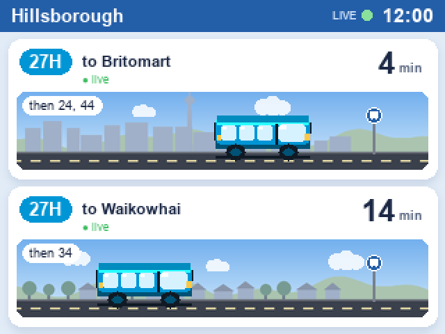
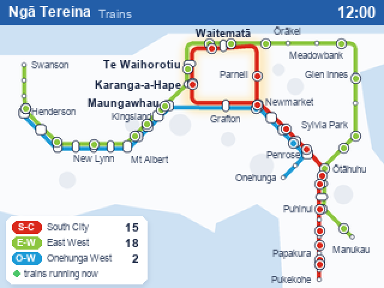
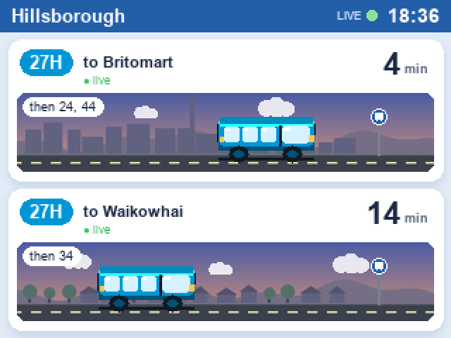
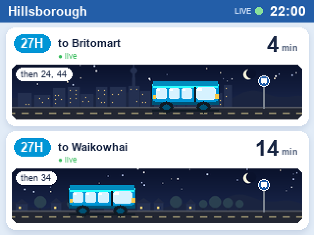

# AT Departure Board

An ESP32 with a 2.0" ST7789 colour display (GMT020-02, 320x240) showing live
Auckland Transport data, driven by your PC over USB.

| Bus stop (day) | Live train map |
|---|---|
|  |  |
| **Dusk** | **Night** |
|  |  |

- **Bus** (`busview.py`): AT-styled cards, one per stop, each with a small
  live scene. The bus slides toward the stop as it gets closer, clouds drift,
  and the sky follows the real time of day (dawn, day, dusk, night with stars
  and lit windows). The Britomart lane shows the city skyline and Sky Tower.
  Default: the 27H both ways at Aldersgate Rd, Hillsborough (stops 8669 and
  8664). The bus pixel art and lane idea come from
  [MSMGreen/at-departure-board](https://github.com/MSMGreen/at-departure-board)
  (MIT, vendored in `atboard/`).
- **Rail** (`railview.py`): a live map of the post-CRL network, drawn after
  AT's official "Ngā Tereina" map. It has the red City Rail Link loop
  (Waitematā, Te Waihorotiu, Karanga-a-Hape, Grafton, Newmarket, Parnell),
  E-W and O-W running side by side out west, interchange pills, harbours and
  volcanic cones. Every train is a dot that glides between position updates.

Press **BOOT** on the ESP32 to switch screens, or set `AUTO_SWITCH` in
`config.py` to swap them every N seconds.

## How it works

The ESP32 has no WiFi and does no fetching. It's a plain USB display.
`bridge.py` on the PC fetches from the AT API and renders each 320x240 frame
with Pillow at 8 fps. It finds what changed in 16x8 tiles and sends only
those rectangles, run-length encoded, at 230400 baud. A typical animated
frame costs well under 1 KB. The board decodes them with a viper function and replies `K`
after each rectangle (`B` when BOOT is pressed).

## Wiring

| Display | ESP32 |
|---|---|
| VCC | 3V3 |
| GND | GND |
| SCL | GPIO 18 |
| SDA | GPIO 23 |
| CS  | GPIO 5 |
| DC  | GPIO 16 |
| RST | GPIO 17 |

## Setup

1. Flash MicroPython (ESP32_GENERIC, v1.29) at 0x1000.
2. `cp config.example.py config.py`, then add your AT API key
   (dev-portal.at.govt.nz, "GTFS" product) and your stops.
3. Upload the board files (bridge.py must not be running):

       python -m mpremote connect COM13 fs cp st7789.py :st7789.py + fs cp config.py :config.py + fs cp ui.py :ui.py + fs cp main.py :main.py + reset

4. On the PC: `pip install pyserial pillow numpy`, then `python bridge.py`
   and leave it running. `python bridge.py --preview` saves bus.png and
   rail.png without the board.

## Files

| File | Where | What |
|---|---|---|
| `bridge.py` | PC | AT data, frame rendering, USB link |
| `busview.py` | PC | the bus screen |
| `railview.py` | PC | the rail map and GPS-to-map train placement |
| `atboard/` | PC | bus sprites + layout from MSMGreen/at-departure-board (MIT) |
| `main.py`, `ui.py`, `st7789.py` | board | USB display |
| `tools/stations.json` | PC | station coordinates from AT GTFS |

## Notes

- When nothing on screen changes, the PC resends one pixel every 5 s so the
  board knows it's still connected. The board resets itself 20 s after the PC stops sending, which puts it back
  at 115200 baud so mpremote can reach it.
- Links faster than 230400 baud drop bytes: MicroPython drains stdin one
  character at a time. MicroPython 1.29 also throws `ESP_ERR_INVALID_STATE`
  when the REPL UART's baud is changed, but the change still takes effect.
- SPI runs at 20 MHz. At 40 MHz, breadboard jumper wires corrupt long fills.

## Licence

MIT; see `LICENSE`. `atboard/` is from
[MSMGreen/at-departure-board](https://github.com/MSMGreen/at-departure-board)
under its own MIT licence (`atboard/LICENSE`). Data comes from the Auckland
Transport developer API. This is an independent hobby project, not affiliated
with Auckland Transport.
